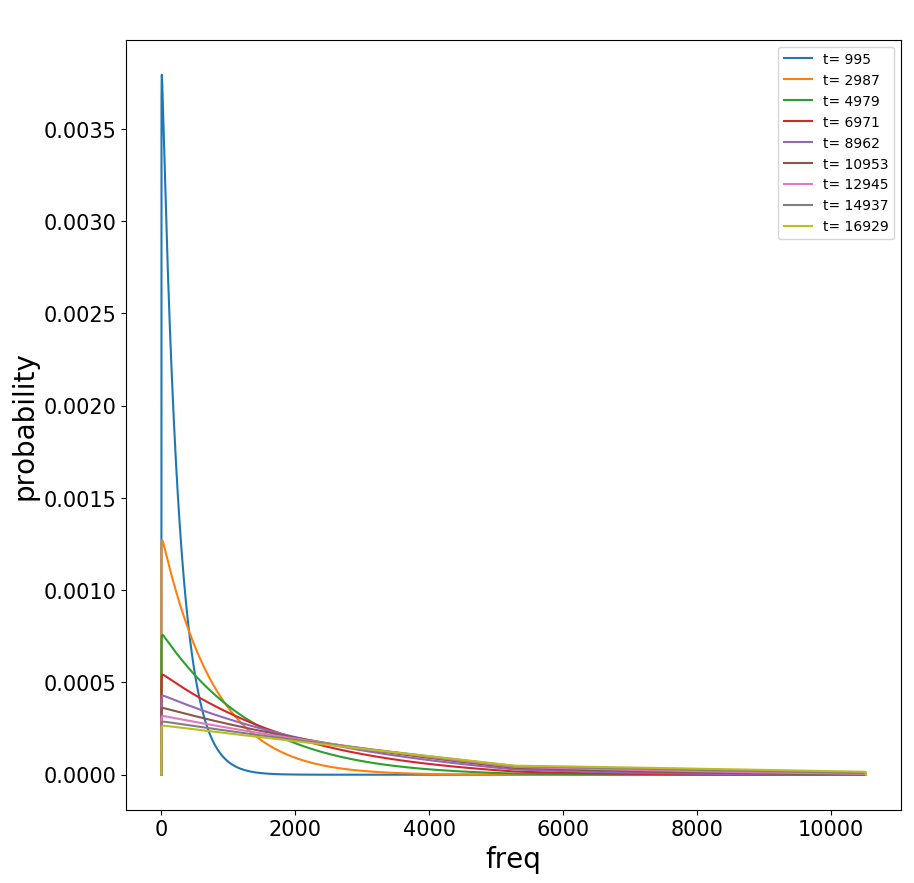

## Site Frequency Spectrum

In this directory we rely Markov Chains to model allele frequency  evolution. 

Our practical objective is to estimate the expected number of segregating variants in samples of modern day haplotypes. 

One way to do this is to estimate what the frequency distribution of these alleles is in populations of interest. 

**setup**

We are interested only in alleles up to a certain age, and we know the rate at which new alleles rise in time. Under neutral conditions this is a relation between the mutation rate *per* base pair *per* generation and the effective size of the population. 

The problem comes in describing the likely frequency of each new variant in the present. Luckily, the jump in frequency of one allele from one generation to the next can be moddelled as a transition matrix.

### I. Introduction. 

Uniform Ne. Number and SFS of segregating alleles.

- [notebook](https://nbviewer.jupyter.org/github/SantosJGND/MCM/blob/master/Pop_gen_PA/SFS_MCM_PA.ipynb).

### II. Changing Ne. 

Varying Ne as a function of time. Explore effect for single population.

- [notebook](https://nbviewer.jupyter.org/github/SantosJGND/MCM/blob/master/Pop_gen_PA/NE_change.ipynb).

**example**

Frequency probability if segregating alleles of different ages for example species:

